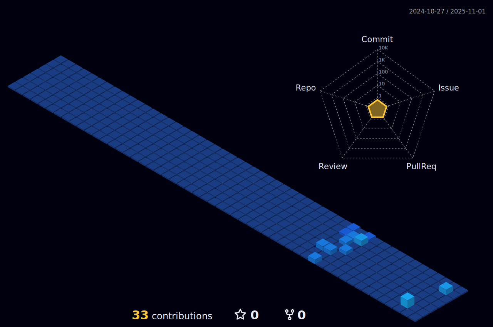

### Hi there 👋

# About Me :
I'm a software developer trying to learn as much as I can. Learn more about me here: <a href =https://dggomez.github.io/> CLICK ME</a>

## 🌐Socials
 

# 💻Tech Stack
          
# 📊GitHub Stats :
 
 

---

  ## 💰You can help me by Donating
   

You can find my resume in this repo as well
  
